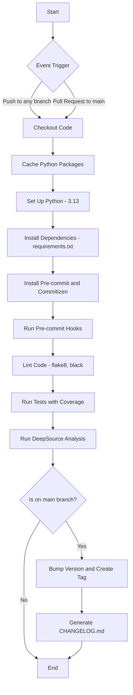

# DAILY PYTHON

- [Repository Description](#repository-description)
- [Environment Description](#environment-description)
- [Principles of Repository Organization](#principles-of-repository-organization)
  - [How it Work](#how-it-work)
  - [Pull Request Rules](#pull-request-rules)
  - [Branch Description](#branch-description)
    - [Prefixes for Branch](#prefixes-for-branch)
    - [Naming Convention for Branch](#naming-convention-for-branch)
	- [How to Checkout Branch](#how-to-checkout-branch)
  - [Commit Description](#commit-description)
    - [How to Commit Changes by Commitizen](#how-to-commit-changes-by-commitizen)
    - [Prefixes for Commits](#prefixes-for-commits)
	- [Naming Convention for Commit](#naming-convention-for-commit)
	- [How Structure of Commit Looks Like](#how-structure-of-commit-looks-like)
  - [What Guides Us When Writing Code](#what-guides-us-when-writing-code)
  - [Protection mechanisms](#protection-mechanisms)
    - [Branch](#branch)
	- [Hooks](#hooks)
	- [Workflows](#workflows)


## Repository Description
Simple coding tasks :)

## Environment Description
- Python 3.13.1

The necessary packages are in the file **requirements.txt**

A virtual environment is also available in the repository: [**venv**](https://docs.python.org/3/library/venv.html)

## Principles of Repository Organization
In project, we use different conventional types of branches and commits to facilitate code management and maintain project clarity.

[**Conventional Commits**](https://www.conventionalcommits.org/en/v1.0.0/)

[**Conventional Branches**](https://conventional-branch.github.io/)

### How it Work
> [!NOTE]
> 1. Each task is a new feature and has own branch. </br>
> 2. After finishing the task, merge it to the main branch using squash. </br>
> 3. Then we delete the branch and increase tag of version.

### Pull Request Rules
> [!IMPORTANT]
> - <ins>Description:</ins> each pull request must contain a description of the changes made
> - <ins>Merge Strategy:</ins> prefer squash (only squash or rebase are allowed)
> - <ins>No branch multiplication:</ins> after merging a pull request, the branch should be removed
> - <ins>For Avoiding Conflicts:</ins>
>   - kindly please minimize the lifespan of the branch
>   - kindly please work only on own files ! you can use file .github/CODEOWNER !
>   - always find time on code review before merge

### Branch Description
The main development branch is named `main`.

> [!NOTE]
> The main branch is **protected** by the following rules:
>  - require linear history
>  - require a pull request before merging
>    - dismiss stale pull request approvals when new commits are pushed
>    - require review from Code Owners
>    - require approval of the most recent reviewable push
>    - require conversation resolution before merging
>  - block force pushes
>  - restrict deletions
>  - require status checks to pass
>    - require branches to be up to date before merging

#### Prefixes for Branch
- **docs/:** Branches used for configuration and modifications of the project environment.
- **feature/:** Branches used for developing new features.
- **bugfix/:** Branches used for fixing bugs.
- **hotfix/:** Branches used for urgent fixes.
- **release/:** Branches used for preparing a release.
- **chore/:** Branches used for non-code tasks like dependency, docs updates.
- **refactor/:**  Branches used for refactoring code.

#### Naming Convention for Branch

> [!IMPORTANT]
> We create a new branch following the rule:
>
> `prefix/[<issue-number>-]<short-description>` e.g., `chore/1-docs-for-rules-of-collaboration` or `chore/docs-for-rules-of-collaboration`.

#### How to Checkout Branch

**Step 1:** `git fetch origin`

**Step 2:** `git checkout -b <new-branch-name>`


### Commit Description

> [!TIP]
> To maintain uniform naming for commits you can use the tool:
>
> [**commitizen**](https://commitizen-tools.github.io/commitizen/)

#### How to Commit Changes by Commitizen

**Step 1:** [Install Python](https://www.python.org/downloads/)

**Step 2:** [Install Commitizen](https://pypi.org/project/commitizen/)

**Step 3:** Stage changes in your files: `git add`

**Step 4:** Instead of `git commit` command use `cz commit`

**Step 5:** Answer the questions displayed in the terminal. The program will help you commit changes according to the conventional commit template.

#### Prefixes for Commits
- **feat/:** Commits used for developing new features.
- **fix/:** Commits used for fixing bugs.
- **refactor/:** Commits used for code refactoring.
- **test/:** Commits used for tests.
- **build/:** Commits used for changes in project structure.
- **ci/:** Commits used for changes in CI/CD configuration.
- **perf/:** Commits used for performance improvements.
- **style/:** Commits used for code style (does not affect logic).
- **docs/:** Commits used for documentation, configuration and modifications of the project environment.

#### Naming Convention for Commit

> [!IMPORTANT]
> We create a new commit following the rule:
>
> `prefix(scope):<description>` e.g., `docs(README.md): rules of collaboration`.

#### How Structure of Commit Looks Like
```
prefix(scope): <description>

<body>

<footer(s)>
```

> [!IMPORTANT]
> The **commitizen** tool uses the `|` character to start a new line in the `<body>` section.

```
docs(README.md): rules of collaboration

Add README.md.
The file contains basic information about the repository and describes its operational rules.

issue: #1
```

### What Guides Us When Writing Code

> [!NOTE]
> - Naming Conventions:
>   - **Pascal Case**: for classes => `UserRepository`
>   - **Pascal Case** + **Prefix I**: for interfaces => `IUserRepository`
>   - **Camel Case**: for variables and methods => `myVariable`, `myMethod`
>   - **Snake Case**: for database descriptions => `my_variable`

> [!WARNING]
> It is recommended that **interface names** differ from the names of the implementing classes only by the **prefix _I_**.
> For example, if the implementing class is named `UserRepository`, the interface should be named `IUserRepository`.

> [!TIP]
> - Principles of Clean Code:
>   - **Readability**: Code should be easy to read.
>   - **Clarity**: Avoid ambiguous abbreviations and names.
>   - **Modularity**: Each module should be small and have a single responsibility.
>   - **Avoid Duplication**: DRY (_Don't Repeat Yourself_).
>   - **Don't Complicate**: KISS (_Keep It Simple, Stupid_).
>   - **Don't Generate Excess Code**: YAGNI (_You Aren't Gonna Need It_).
>   - **Comments**: Comment only when necessary, and when essential information cannot be conveyed through naming.

> [!TIP]
> - SOLID:
>   - **S** => _Single Responsibility Principle_
>   - **O** => _Open/Closed Principle_
>   - **L** => _Liskov Substitution Principle_
>   - **I** => _Interface Segregation Principle_
>   - **D** => _Dependency Inversion Principle_

> [!TIP]
> - TESTING:
>   - **TDD** (_Red-Green-Refactor_)
>   - **_Given-When-Then_**

### Protection mechanisms

#### Branch

 The main branch is **protected** by the following rules:
  - require linear history
  - require a pull request before merging
    - dismiss stale pull request approvals when new commits are pushed
    - require review from Code Owners
    - require approval of the most recent reviewable push
    - require conversation resolution before merging
  - block force pushes
  - restrict deletions
  - require status checks to pass
    - require branches to be up to date before merging

#### Hooks

  - [pre-commit](https://github.com/pre-commit/pre-commit-hooks) v5.0.0
      - check-added-large-files
      - check-ast
      - check-case-conflict
      - check-docstring-first
      - check-executables-have-shebangs
      - check-shebang-scripts-are-executable
      - fix-encoding-pragma
      - check-illegal-windows-names
      - check-json
      - pretty-format-json
      - check-yaml
      - sort-simple-yaml (excluding configuration files)
      - check-toml
      - check-xml
      - file-contents-sorter
      - check-merge-conflict
      - check-symlinks
      - destroyed-symlinks
      - debug-statements
      - check-builtin-literals
      - end-of-file-fixer
      - trailing-whitespace
      - detect-aws-credentials
      - detect-private-key
      - forbid-submodules
      - name-tests-test
      - no-commit-to-branch (for main)
      - requirements-txt-fixer

  - [black](https://github.com/psf/black) v24.10.0
      - black

  - [flake](https://github.com/PyCQA/flake8) v7.1.1
      - flake8

#### Workflows

Below is the workflow .github\workflows\ci.yml


